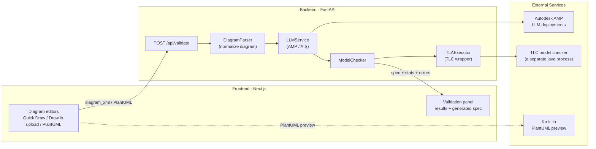

# Chaos Checker

Chaos Checker validates system designs using AI-powered formal verification. Draw or upload your architecture, generate a formal specification (TLA+ / PlusCal / Fizzbee), and run model checking to uncover bugs and inconsistencies before they reach production.

## Features

- **Multi-mode diagram input**
  - **Quick Draw canvas** powered by React Flow (`SimpleDiagramEditor`) with rich shapes, labels, and export to XML.
  - **Draw.io upload** (`DiagramUploader`) for `.drawio` / `.xml` diagrams exported from `app.diagrams.net`.
  - **PlantUML editor** (`PlantUMLEditor`) with text editing and live SVG preview via Kroki.
- **AI-powered specification generation**
  - Uses Autodesk AMP (AI/ML Platform) via AIS (`LLMService`) to turn diagrams into formal specs.
  - Supports **TLA+** (first-class, TLC-ready), **PlusCal**, and **Fizzbee** styles depending on request.
- **Real TLA+ model checking**
  - Backend `ModelChecker` + `TLAExecutor` execute TLC via `tla2tools.jar` with proper `.tla` + `.cfg` handling.
  - Automatically generates a default CFG when the LLM returns only TLA+.
- **Rich validation experience**
  - `ValidationPanel` shows success/failure, structured error list, traces, and model-checking statistics.
  - Full generated spec is viewable and copyable for manual TLC runs.
- **Authentication-aware UI**
  - Autodesk OAuth token-based gating of the main dashboard (`app/page.tsx`, `app/dashboard/page.tsx`, `frontend/utils/auth.ts`).
- **Modern UX**
  - Next.js 13 App Router, Tailwind-based dark/light theme, responsive layout, and polished micro-interactions.

## Architecture

- **Frontend (Next.js + React)**
  - `app/page.tsx` routes authenticated users to `/dashboard` and guests to `/login`.
  - `app/dashboard/page.tsx` hosts the main layout with `DiagramEditorTabs` and `ValidationPanel`.
  - `DiagramEditorTabs` switches between:
    - `SimpleDiagramEditor` (React Flow "Quick Draw" canvas → custom XML),
    - `DiagramUploader` (draw.io XML upload),
    - `PlantUMLEditor` (raw PlantUML text).
  - `Header` and auth utilities (`frontend/utils/auth.ts`) manage Autodesk OAuth tokens in local storage.

- **Backend (FastAPI, Python)**
  - `app.py` exposes:
    - `GET /` – health check,
    - `POST /api/validate` – main validation pipeline,
    - `POST /api/parse-diagram` – debugging endpoint returning parsed diagram structure.
  - `DiagramParser` normalizes draw.io XML / Quick Draw XML / PlantUML into a common `nodes` + `edges` graph with metadata.
  - `LLMService` (AMP/AIS) builds constrained prompts and generates TLA+ (plus optional CFG), PlusCal, or Fizzbee specs.
  - `ModelChecker` routes by language and delegates TLA+ to `TLAExecutor` for real TLC runs.

- **Model checking & tooling**
  - `TLAExecutor` writes `.tla` / `.cfg` to temp files, runs `tla2tools.jar`, and parses TLC output into:
    - `status`, `message`, `errors[]`, `warnings[]`, `stats`, `raw_output`.
  - `ModelChecker` wraps executor results into the `validation_result` structure returned to the frontend.

- **External services**
  - **Autodesk AMP / AIS** – LLM deployments (Claude, GPT-4o, etc.) selected via `AMP_DEPLOYMENT`.
  - **TLA+ tools** – `tla2tools.jar` discovered via `TLA_TOOLS_PATH`, `backend/tools/`, or project root.
  - **Kroki** – `https://kroki.io/plantuml/svg` for PlantUML diagram preview (frontend-only).

### Architecture Diagram



## 🚀 Quick Start for Team Members

**New to the project?** Follow the onboarding guide:

- **[TEAM_SETUP.md](TEAM_SETUP.md)** – complete team setup (APS credentials, AMP CLI, VPN, first run).

Once you're onboarded, you can use the shorter quick-start instructions in:

- **[QUICKSTART.md](QUICKSTART.md)** – local-dev focused quick start.

---

## Setup Overview

### Prerequisites

- **Python 3.13** (not 3.14 yet) – see `backend/requirements.txt`.
- **Node.js 18+** – for the Next.js frontend.
- **Autodesk VPN** – required for AMP / AIS endpoints.
- **APS credentials** – create at `https://aps-dev.autodesk.com` (or corresponding env).
- **AMP CLI** – optional but recommended for exploring deployments (`amp deployments list`).

### Backend (FastAPI + AMP + TLA+)

```bash
cd backend
cp env.template .env        # fill in APS credentials & AMP deployment

python3.13 -m venv venv
source venv/bin/activate    # Windows: venv\Scripts\activate
pip install -r requirements.txt

# (Optional but recommended) download TLA+ tools
./setup_tools.sh            # or place tla2tools.jar as described in env.template

python app.py               # starts on http://localhost:8000
```

Key backend environment variables (see `backend/env.template`):

```bash
APS_CLIENT_ID=your_client_id_here
APS_CLIENT_SECRET=your_client_secret_here
AMP_ENV=dev
AMP_DEPLOYMENT=playground-claude-4-sonnet
LLM_PROVIDER=amp
# Optional: TLA_TOOLS_PATH=/absolute/path/to/tla2tools.jar
```

### Frontend (Next.js)

```bash
cd frontend
npm install

# Create env file if you don't already have one
echo "NEXT_PUBLIC_API_URL=http://localhost:8000" > .env.local

npm run dev                 # opens on http://localhost:3000
```

🔒 **Never commit `.env` / `.env.local` files** – they contain secrets.

## Usage

1. Open `http://localhost:3000` in your browser and authenticate (Autodesk OAuth).
2. On the **Dashboard**, pick how you want to define your system:
   - **Quick Draw** tab – sketch a state machine / architecture with shapes and labeled edges.
   - **Upload Draw.io** tab – upload a `.drawio` / `.xml` exported from `app.diagrams.net`.
   - **PlantUML** tab – paste or write PlantUML, optionally previewing via Kroki.
3. Choose a **specification language** (typically **TLA+** for full TLC checking).
4. Click **"Validate Design"**.
5. Inspect:
   - Generated formal spec (TLA+ / PlusCal / Fizzbee),
   - Any errors (deadlocks, invariant violations, race conditions, etc.),
   - Model checking statistics.

## How It Works

1. **Diagram capture**
   - Quick Draw → React Flow graph → lightweight draw.io-style XML.
   - Draw.io upload → raw `.drawio` / `.xml`.
   - PlantUML editor → raw PlantUML text.
2. **Parsing & normalization**
   - `DiagramParser` converts the chosen representation into `nodes`, `edges`, and metadata (including `format` and `raw_plantuml` when present).
3. **LLM translation**
   - `LLMService` builds a strongly constrained prompt (with TLA+ syntax guardrails) and calls AMP / AIS.
   - The response is parsed into `.tla` + `.cfg` segments when possible.
4. **Model checking**
   - `ModelChecker`:
     - For **TLA+**: uses `TLAExecutor` to run TLC (the TLA+ model checker) in a separate Java process and parse real output.
     - For **PlusCal / Fizzbee**: runs lighter-weight, heuristic checks today (extensible).
5. **Result presentation**
   - The API returns `success`, `message`, `validation_result`, and `errors[]`.
   - `ValidationPanel` renders a human-friendly summary, detailed error traces, and the generated spec.

## Supported Diagram Types

- State machines and workflows.
- Distributed systems and microservices.
- Concurrent / asynchronous processes.
- Client–server and request–response flows.
- Database-backed architectures and transactional flows.
- Consensus / coordination protocols (e.g., leader election).

## 📚 Documentation

| Document | Purpose | Audience |
|----------|---------|----------|
| **[TEAM_SETUP.md](TEAM_SETUP.md)** | End-to-end onboarding with AMP & APS | New team members |
| **[SETUP.md](SETUP.md)** | Additional setup notes and variations | Contributors |
| **[QUICKSTART.md](QUICKSTART.md)** | 5-minute local quick start | Everyone |
| **[PROJECT_STATUS.md](PROJECT_STATUS.md)** | Snapshot of MVP status and future work | Maintainers |
| **[backend/env.template](backend/env.template)** | Backend env configuration template | Everyone |
| **[backend/README_TLA_EXECUTOR.md](backend/README_TLA_EXECUTOR.md)** | TLA+ executor and TLC integration details | Backend developers |

## 🆘 Getting Help

- **Setup / env issues** – start with [TEAM_SETUP.md](TEAM_SETUP.md) and [SETUP.md](SETUP.md).
- **AMP / AIS questions** – internal Slack: `#pset-ad-amp-support`.
- **Backend / model checking issues** – see `backend/README_TLA_EXECUTOR.md` and backend logs.
- **Bugs / feature requests** – open an issue in this repo.

## License
Copyright (c) 2025 Autodesk, Inc. All rights reserved.